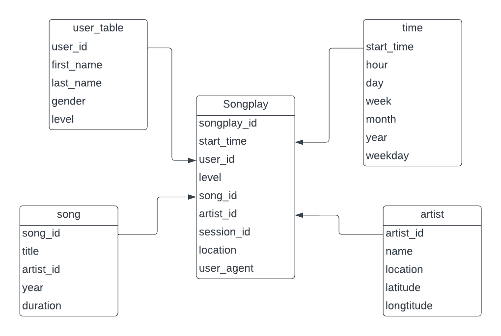

# Data Warehouse (Udacity Data Engineering Nanodegree Project `Data Warehouse`)

## Business Overview
A music streaming startup, Sparkify, has grown their user base and song database and want to move their processes and data onto the cloud. Their data resides in S3, in a directory of JSON logs on user activity on the app, as well as a directory with JSON metadata on the songs in their app.

## Project Objective
Building an ETL pipeline which:
 - Extracts Sparkify data from S3 
 - Stage the data in Redshift
 - Transforms data into a set of dimensional tables for Sparkify's analytics team to continue finding insights into what songs their users are listening to.

## Project Dataset
There are 3 datasets which reside in S3:
- Song data: `s3://udacity-dend/song_data`
- Log data: `s3://udacity-dend/log_data`
- This third file `s3://udacity-dend/log_json_path.json` contains the meta information that is required by AWS to correctly load `s3://udacity-dend/log_data`

## Process Description

### Star Schema


### Defining SQL statements 
All the SQL statments used in this projects are stored in `sql_queries.py`: 
- `DROP` statements to drop all tables at the beginning to quickly reset the database and test the ETL. 
- `CREATE` statements to create all the tables needed. 
- `INSERT` statements to load data into the staging tables and to insert data into fact and dimension tables. 

### Creating Redshift cluster
Launch a redshift cluster and create an IAM role that has read access to S3. Add redshift database and IAM role info to `dwh.cfg`.

### Creating tables

All tables are created (or dropped) from `create_tables.py`
#### Staging tables

- `staging_event` provide log data extracting from `s3://udacity-dend/log_data`

- `song_data` provide song and artist data from `s3://udacity-dend/song_data`
  
#### Dimension tables

- `song`: songs which were played

- `artists`: artist data whose songs were played

- `users`: user data

- `time`: time data when users played songs

#### Fact table

- `songplays`: records in event data associated with song plays i.e. records with page `NextSong`

### Build ETL Pipeline
- Implement the logic in `etl.py` to load data from S3 to staging tables on Redshift.
- Implement the logic in `etl.py` to load data from staging tables to analytics tables on Redshift.
- Test by running `etl.py` after running `create_tables.py` and running the analytic queries on Redshift database to compare validate. 

## Sample queries
### What is the top 5 most played songs ?

**Query:**
```
SELECT sp.song_id, s.title, COUNT(sp.song_id) AS count
FROM songplay sp
JOIN song s ON sp.song_id = s.song_id
GROUP BY sp.song_id, s.title
order by count desc
limit 5
```

**Result:**

song_id | title | count
---------- | ------ | -----
SOBONKR12A58A7A7E0 | You're The One | 37
SOUNZHU12A8AE47481 | I CAN'T GET STARTED | 9
SOHTKMO12AB01843B0 | Catch You Baby (Steve Pitron & Max Sanna Radio Edit)	 | 9
SOULTKQ12AB018A183 | Nothin' On You [feat. Bruno Mars] (Album Version) | 8
SOLZOBD12AB0185720 | Hey Daddy (Daddy's Home) | 6

### When is the highest usage time of day by hour for songs?

**Query:**
```
SELECT t.hour, COUNT(sp.songplay_id) AS songplay_count
FROM songplay sp
JOIN time t
ON sp.start_time = t.start_time
GROUP BY t.hour
ORDER BY songplay_count DESC
LIMIT 5;
```

**Result:**

hour | songplay_count 
---------- | ------ 
16 | 542
18 | 498
17 | 494	 
15 | 477 
14 | 432 
